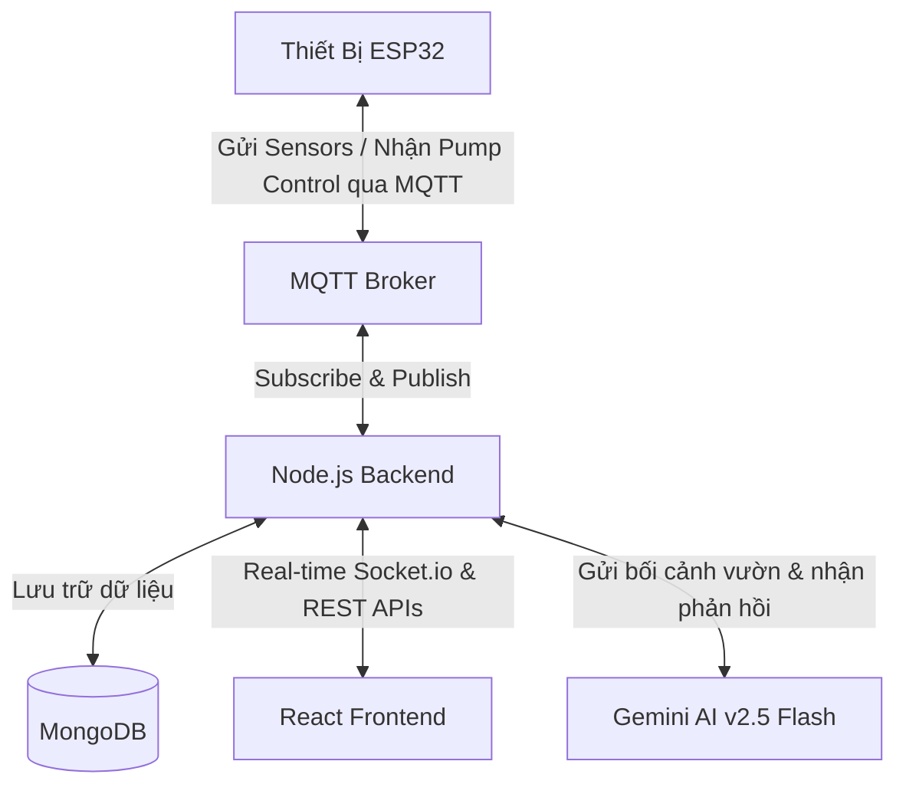

# Hệ Thống Vườn Thông Minh - Smart Garden IoT (Mushroom House Assistant)

Dự án Hệ Thống Vườn Thông Minh (Smart Garden IoT) là giải pháp toàn diện cho việc giám sát, tự động hóa và quản lý tối ưu nhà vườn/nhà nấm thông minh. Hệ thống tích hợp phần cứng ESP32 để đo đạc các chỉ số môi trường, máy chủ Backend (Node.js/Express) để xử lý dữ liệu và tích hợp trợ lý AI thông minh (Gemini), cùng giao diện Frontend (React) trực quan cho người dùng.

---

## 🏗️ Kiến Trúc Hệ Thống

Hệ thống được thiết kế theo mô hình client-server truyền thống kết hợp giao thức IoT thời gian thực:



1. **Hardware (ESP32):** Thu thập dữ liệu từ các cảm biến (Nhiệt độ/Độ ẩm không khí, Độ ẩm đất, Mực nước, Cường độ ánh sáng) và gửi về Server qua giao thức MQTT. Lắng nghe các lệnh điều khiển máy bơm từ Server và thực hiện đóng/ngắt Relay. Có cơ chế tự động ngắt bơm an toàn khi mực nước bể cạn.
2. **Backend (Node.js/Express/TypeScript):** 
   - Nhận dữ liệu cảm biến từ MQTT Broker và lưu trữ vào MongoDB.
   - Quản lý tài khoản (Auth), phân quyền, quản lý khu vực trồng (Houses), thiết bị (Devices), và các ngưỡng lý tưởng của cây trồng (Presets).
   - Tích hợp trợ lý AI Gemini thông qua `@google/genai` để phân tích tình trạng sức khỏe của vườn nấm dựa trên dữ liệu cảm biến thời gian thực.
   - Giao tiếp thời gian thực với Frontend thông qua WebSockets (Socket.io).
3. **Frontend (React/Vite/TypeScript):**
   - Dashboard hiển thị các thông số cảm biến dạng biểu đồ và thẻ thông số thời gian thực.
   - Các nút bấm bật/tắt thiết bị ngoại vi (máy bơm) từ xa.
   - Giao diện trò chuyện trực tiếp với Trợ lý AI Gemini chuyên gia nông nghiệp thông minh.
   - Quản lý các cấu hình ngưỡng lý tưởng (Presets) cho từng loại nấm/cây trồng.

---

## 📂 Cấu Trúc Thư Mục Dự Án

Dự án được phân chia thành 3 thư mục chính:

* **[Backend](file:///d:/2025.2/Iot%20va%20ung%20dung/Project/Backend)**: Mã nguồn của máy chủ dịch vụ viết bằng TypeScript, sử dụng Express, MongoDB, Socket.io, Redis, Nodemailer và Gemini API.
* **[Frontend](file:///d:/2025.2/Iot%20va%20ung%20dung/Project/Frontend)**: Ứng dụng giao diện người dùng viết bằng React + Vite + TypeScript.
* **[Smart-GardenEsp32](file:///d:/2025.2/Iot%20va%20ung%20dung/Project/Smart-GardenEsp32)**: Mã nguồn chương trình Arduino (C++) dành cho kit vi điều khiển ESP32 và các cảm biến.

---

## ⚡ Hướng Dẫn Chạy Dự Án Nhanh

### Yêu Cầu Hệ Thống
* Node.js (v18 trở lên)
* MongoDB (Chạy cục bộ hoặc MongoDB Atlas)
* MQTT Broker (Ví dụ: EMQX Broker cục bộ hoặc HiveMQ Cloud, ThingsBoard)
* Redis (Dùng để cache/hàng đợi nếu có cấu hình)

### Các Bước Thực Hiện

#### Bước 1: Khởi động Backend
1. Truy cập thư mục [Backend](file:///d:/2025.2/Iot%20va%20ung%20dung/Project/Backend):
   ```bash
   cd Backend
   ```
2. Cài đặt các thư viện phụ thuộc:
   ```bash
   npm install
   ```
3. Tạo file cấu hình môi trường `.env` dựa trên file `.env` mẫu có sẵn trong thư mục, cập nhật thông tin MongoDB, MQTT Broker và API Key Gemini:
   ```env
   PORT=3000
   MONGO_URI=mongodb://127.0.0.1:27017/smart_garden
   GEMINI_API_KEY=your_gemini_api_key
   # Cấu hình MQTT, SMTP, v.v.
   ```
4. Khởi động Server ở chế độ nhà phát triển (Development):
   ```bash
   npm run dev
   ```

#### Bước 2: Khởi động Frontend
1. Truy cập thư mục [Frontend](file:///d:/2025.2/Iot%20va%20ung%20dung/Project/Frontend):
   ```bash
   cd ../Frontend
   ```
2. Cài đặt các thư viện phụ thuộc:
   ```bash
   npm install
   ```
3. Khởi động giao diện Web Client:
   ```bash
   npm run dev
   ```
4. Mở trình duyệt và truy cập: [http://localhost:5173](http://localhost:5173).

#### Bước 3: Nạp Code cho ESP32
1. Mở mã nguồn [smart-garden-esp32.ino](file:///d:/2025.2/Iot%20va%20ung%20dung/Project/Smart-GardenEsp32/smart-garden-esp32/smart-garden-esp32.ino) bằng Arduino IDE hoặc VS Code (với PlatformIO).
2. Chỉnh sửa thông tin WiFi và thông tin MQTT Broker phù hợp tại thư mục `config`:
   - [wifi.h](file:///d:/2025.2/Iot%20va%20ung%20dung/Project/Smart-GardenEsp32/smart-garden-esp32/config/wifi.h)
   - [mqtt.h](file:///d:/2025.2/Iot%20va%20ung%20dung/Project/Smart-GardenEsp32/smart-garden-esp32/config/mqtt.h)
3. Cài đặt các thư viện Arduino cần thiết (DHT sensor library, PubSubClient, BH1750, v.v.).
4. Kết nối kit ESP32 vào máy tính và nhấn **Upload**.

---

## 🤖 Trợ Lý Trí Tuệ Nhân Tạo (AI Assistant)

Hệ thống tích hợp mô hình **Gemini 2.5 Flash** làm trợ lý nông nghiệp thông minh. 
* Trợ lý ảo tự động phân tích các thông số nhiệt độ, độ ẩm không khí, độ ẩm đất và ánh sáng thực tế đang được gửi về từ ESP32.
* So sánh dữ liệu thực tế này với ngưỡng lý tưởng được cấu hình trong Preset (Ví dụ: ngưỡng phát triển tốt của Nấm Bào Ngư, Nấm Linh Chi...).
* Đưa ra cảnh báo thông minh nếu các thông số vượt ngưỡng (ví dụ: *"Nhiệt độ hiện tại 35°C quá cao so với ngưỡng 28°C của nấm bào ngư, bạn nên bật máy bơm phun sương ngay"*).

---

## 📄 Bản Quyền & Giấy Phép
Dự án được phát triển phục vụ môn học **IoT và Ứng dụng** kì học 2025.2.
